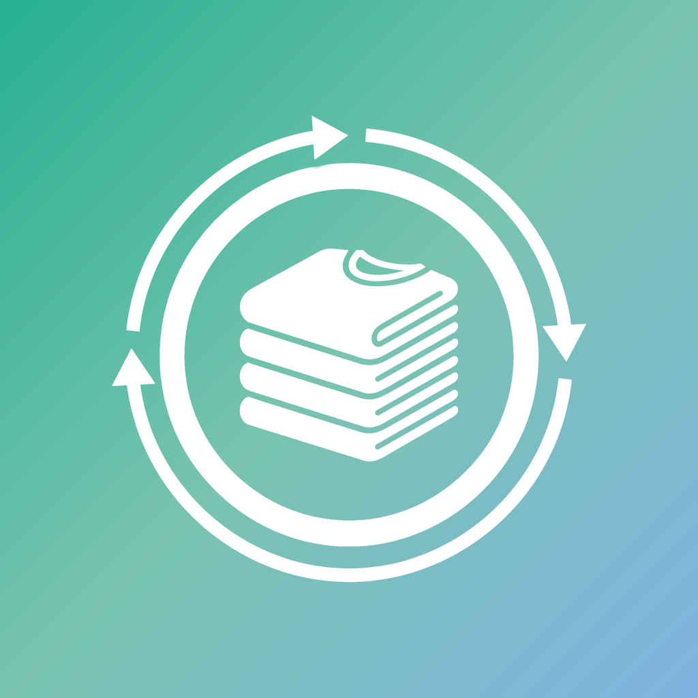

<p align="center">
  
</p>

<h1 align="center">Plietsche Plünn</h1>

<p align="center">
  Die App für den Kleidertausch-Laden.<br>
  Vorbeikommen, mitnehmen, bringen — und dafür Punkte sammeln.
</p>

<p align="center">
  
  
  
  
  
  
</p>

---

## Worum es geht

Ein Kleidertausch-Laden lebt davon, dass Menschen wiederkommen — und dass sie nicht nur
nehmen, sondern auch bringen. Genau das macht diese App sichtbar: Jeder Besuch, jedes
mitgenommene und jedes gebrachte Teil zählt Punkte. Aus Punkten werden Ränge, aus
Regelmäßigkeit werden Abzeichen.

Das Team verwaltet den Bestand, prüft eingereichte Teile und kann Aktionen fahren, in
denen einzelne Handlungen mehr zählen. Alles läuft über ein selbst gehostetes Backend.

## Funktionen

### Für Besucher:innen

- **Check-in per QR-Code** — Ein Scan an der Ladentür, ein Besuch gezählt. Der Standort
  wird optional geprüft, damit der Check-in wirklich vor Ort passiert.
- **Teile mitnehmen** — QR-Code am Kleidungsstück scannen, Punkte werden gutgeschrieben.
  Wer ohne Code mitnimmt, trägt die Anzahl nach.
- **Punkte, Ränge, Fortschritt** — Punktestand als Ring mit Rang und Abstand zum
  nächsten. Der Text darunter passt sich der Lage an: kurz vor dem Aufstieg, laufende
  Aktion, gefährdete Serie oder längere Abwesenheit.
- **Abzeichen in Stufen** — Bronze bis Diamant, für Besuche, mitgenommene und gebrachte
  Teile, Wochen in Folge, Jahre Treue und Aktionsteilnahme. Jede Stufe zahlt einen Bonus.
- **Punkte-Historie** — Nach Tagen gruppiert, filterbar nach Check-ins, Teilen und
  Abzeichen.
- **Im Laden stöbern** — Alle verfügbaren Teile mit Foto, Größe und Punktwert. Filter
  nach Zielgruppe, Art, Größe und Aufbewahrung.
- **Schaufenster** — Kuratierte Highlights des Teams.
- **Teile einreichen** — Foto, Größe, Zustand und die Angabe, ob das Teil in den Laden
  kommt oder extern bleibt. Nach der Freigabe durch das Team gibt es Punkte.
- **Aushang** — Laufende Aktionen und Ankündigungen auf der Startseite.
- **Benachrichtigungen nach Wahl** — Vier getrennte Kategorien, jede einzeln abschaltbar.
- **Laden-Info** — Öffnungszeiten, Adresse mit Routenstart, Telefonnummer.

### Für das Team

- **Freigaben** — Eingereichte Teile prüfen, bearbeiten und freigeben, wahlweise direkt
  ins Schaufenster. Offene Vorgänge sind auf der Startseite nicht zu übersehen.
- **Inventar** — Alle Teile mit Status, Filtern und QR-Vorschau. Etiketten lassen sich
  direkt aus der Detailansicht drucken.
- **Teile direkt einstellen** — Ohne Freigabeschleife, inklusive internem Lagerort.
- **Aushang pflegen** — Ankündigungen mit Schnellvorlagen, Farbwahl und optionalem
  Sofort-Push.

### Für Admins

- **Aktionen** — Zeitraum, Farbe und drei getrennte Faktoren: Vorbeikommen, Mitnehmen
  und Bringen lassen sich unabhängig auf ×1,5, ×2 oder ×3 setzen. Zielgruppe wählbar,
  etwa nur Inaktive oder nur Personen mit laufender Serie.
- **Punkte und Ränge** — Punktwerte je Handlung, Höchstzahl der Teile pro Besuch und die
  komplette Rangleiter frei konfigurierbar.
- **Abzeichen** — Stufen- und Einzelabzeichen anlegen, mit sechs Auslösern, eigenen
  Schwellen, Boni und Symbolen.

## Bemerkenswert

- **Zwei Designsprachen, eine Codebasis** — iOS folgt Apples Gestaltungsregeln, Android
  Material 3. Farben, Schrift und Aufbau sind identisch; unterschiedlich sind Form,
  Tiefe und Reaktion auf Berührung.
- **Datenschutz durch Datenmodell** — Ein mitgenommenes Teil speichert keine Referenz
  auf die Person. Die Verbindung „Person X nahm Teil Y" existiert in der Datenbank
  schlicht nicht.
- **Kein Tracking** — Kein Analytics-SDK, kein Crash-Reporter, keine Werbe-IDs.
- **Ein Scanner für alles** — Der Server erkennt selbst, ob ein Code die Ladentür oder
  ein Kleidungsstück ist.
- **Selbstheilendes Punktekonto** — Der Punktestand wird nach jeder Buchung aus dem
  vollständigen Journal neu summiert statt hochgezählt und kann daher nicht abdriften.
- **Serverseitige Wahrheit** — Punktestand, Serie und Rolle sind gegen Schreibzugriffe
  aus der App geschützt. Der Fortschritt bei Serien-Abzeichen wird aus den echten
  Besuchen abgeleitet, nicht aus einem Zählerfeld.

## Voraussetzungen

- iOS 16.4+ oder Android 7.0+ (API 24)
- Node 22 LTS für die Entwicklung
- Eine PocketBase-Instanz (Docker-Compose liegt bei)

## Installation

### TestFlight

Die iOS-Version läuft aktuell als geschlossene Beta. Version 1.0 ist zur Einreichung
vorbereitet.

### Aus dem Quelltext

```bash
git clone https://github.com/Revisor01/plietsche-pluenn.git
cd plietsche-pluenn/mobile
npm install
npx expo start --dev-client
```

Erfordert ein installiertes Dev-Client-Build. Die Backend-URL wird über
`EXPO_PUBLIC_PB_URL` gesetzt.

### Backend

```bash
docker compose up -d
```

Migrationen und Hooks liegen in `pocketbase/pb_migrations/` und `pocketbase/pb_hooks/`
und werden beim Start automatisch angewandt. Die Zugangsdaten kommen aus
`pocketbase/.env.secrets` (nicht im Repository).

Das ist die Fassung für den eigenen Rechner. In Produktion läuft
`docker-compose.portainer.yml`: ein eigenes Abbild, in dem Hooks und
Migrationen stecken, gebaut und ausgeliefert bei jedem Push auf `main`. Wie das
abläuft, was einmalig umzustellen ist und wie man im Störfall von Hand
ausliefert, steht in [`docs/deploy.md`](docs/deploy.md).

## Aufbau

```
plietsche-pluenn
├── mobile/                    — Expo-App (iOS + Android)
│   ├── app/                   — Bildschirme, dateibasiertes Routing
│   │   ├── (auth)/            — Anmeldung, Registrierung
│   │   ├── (onboarding)/      — Einführung, Berechtigungen
│   │   ├── (visitor)/         — Hauptbereich inkl. Team- und Admin-Ansichten
│   │   └── scan.tsx           — Scanner als Vollbild-Modal
│   ├── components/            — UI-Bausteine, Tab-Leiste, Scanner
│   └── lib/                   — Design-Tokens, API, Hooks, Push, Formatierung
├── pocketbase/
│   ├── pb_hooks/              — Scanner-Endpunkt, Punkte- und Abzeichenlogik,
│   │                            Push-Versand, Cron-Jobs
│   ├── pb_migrations/         — Schema und Startdaten
│   └── Dockerfile             — Abbild für die Auslieferung
├── design/                    — Design-Referenz und Entwurfsvorlagen
├── docs/                      — API-Beschreibung und Auslieferung
├── docker-compose.yml         — lokal
└── docker-compose.portainer.yml — Produktion
```

**Grundentscheidungen:**

- Dateibasiertes Routing mit typisierten Routen
- Serverdaten über TanStack Query, kein manueller Cache
- Geschäftslogik ausschließlich im Backend — die App zeigt an, sie rechnet nicht
- Design-Tokens zentral in `lib/theme.ts`, keine festen Werte in den Bildschirmen
- Keine Fremd-SDKs für Analytik oder Absturzberichte

## Technische Details

Vollständiger Steckbrief mit Versionen, Abhängigkeiten, Datenmodell und Berechtigungen:
[TECH.md](TECH.md)

## Änderungen

Siehe [CHANGELOG.md](CHANGELOG.md).

## Lizenz

[GNU Affero General Public License v3.0](LICENSE) — wer die App oder das
Backend betreibt, muss seine Änderungen ebenfalls offenlegen.

---

## Datenschutz

### Verantwortlich

Simon Luthe
Süderstraße 18
25779 Hennstedt

E-Mail: mail@simonluthe.de
Web: [simonluthe.de](https://simonluthe.de)

### Verarbeitete Daten

Auf dem eigenen Server gespeichert:

- Name und E-Mail-Adresse für das Konto
- Punktestand, Besuche und Abzeichen-Fortschritt
- Eingereichte Teile mit Foto und Beschreibung
- Beim Check-in: Koordinaten und Abstand zum Laden, sofern die Berechtigung erteilt wurde
- Geräte-Token für Benachrichtigungen, sofern zugestimmt

Auf dem Gerät: Anmeldedaten in der System-Schlüsselverwaltung.

### Was bewusst nicht gespeichert wird

- **Keine Zuordnung zwischen Person und mitgenommenem Teil.** Ein vergebenes Teil trägt
  nur einen Zeitstempel.
- Das Punktekonto führt lediglich eine Textnotiz, keinen Verweis auf das Teil.
- Wer ein Teil selbst in den Laden bringt, gibt keine Adresse an.

### Kein Tracking

Keine Analysewerkzeuge, keine Werbung, keine Drittanbieter-SDKs, die Daten sammeln.
Die App verbindet sich ausschließlich mit dem Backend des Ladens und — beim Versand von
Benachrichtigungen — mit dem Push-Dienst von Expo.

### Rechte

Auskunft, Berichtigung und Löschung über die oben genannte Adresse. Benachrichtigungen
lassen sich jederzeit in der App abschalten; das Geräte-Token wird dabei serverseitig
entfernt.

*Stand: August 2026*
